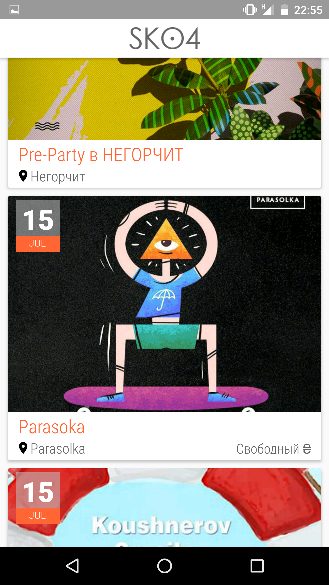
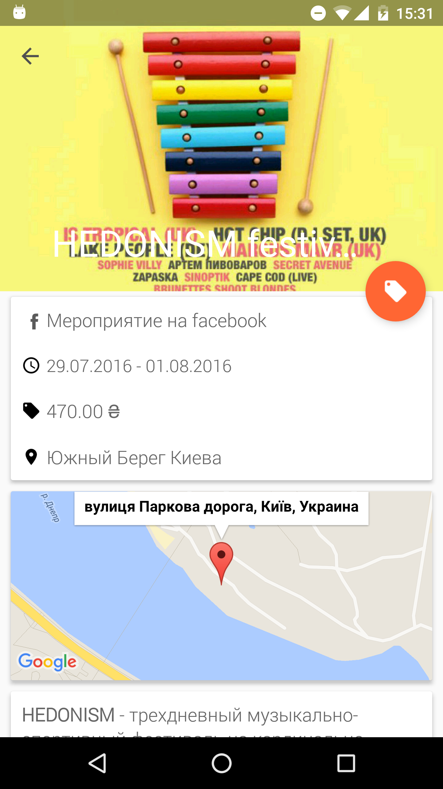
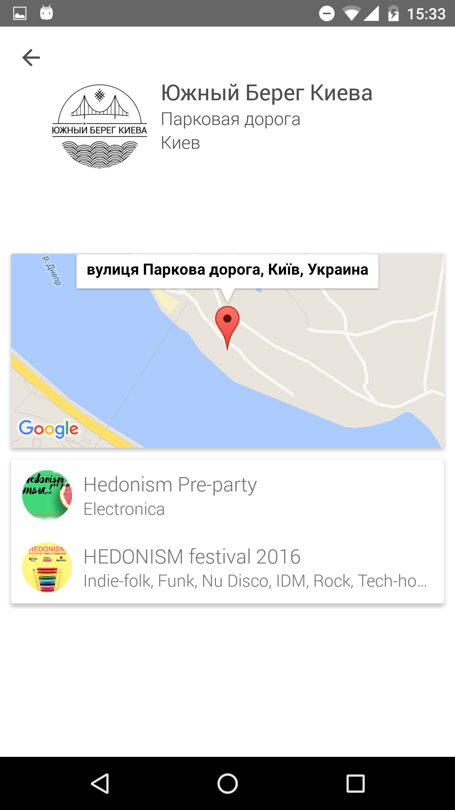

# Sko4
Sko4.com android application source code
Application created with Material design.






# Libraries
[Dagger 2](https://google.github.io/dagger/)
[Retrofit](https://square.github.io/retrofit/)
[Material design](https://design.google.com/)
[RxJava](https://github.com/ReactiveX/RxJava)
[Rxandroid](https://github.com/ReactiveX/RxAndroid)
[Glide](https://github.com/bumptech/glide)
[Butterknife](https://github.com/JakeWharton/butterknife)
[Joda-Time-Android](https://github.com/dlew/joda-time-android)

# Sko4 API

Get all events
```
http://sko4.com/api/
```

Get event details
```
http://sko4.com/api/[id]
```

Get artist info
```
http://sko4.com/api/artist/[id]
```

Get venue info
```
http://sko4.com/api/venue/[id]
```
